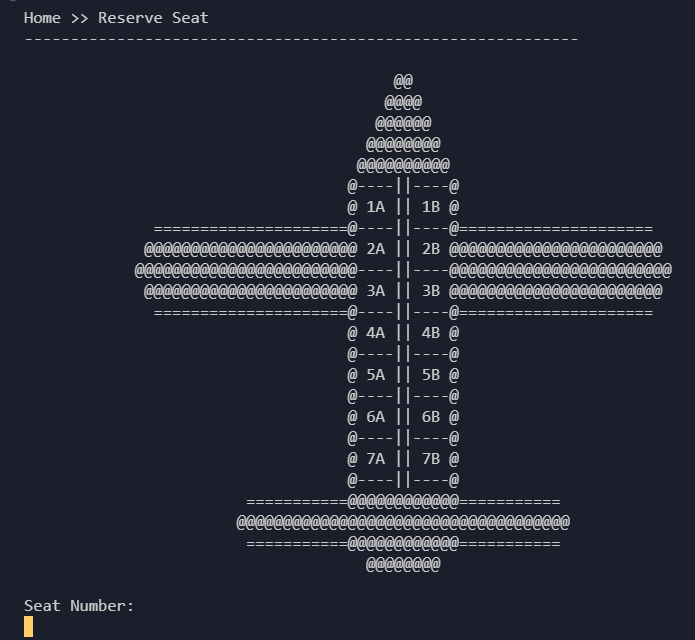
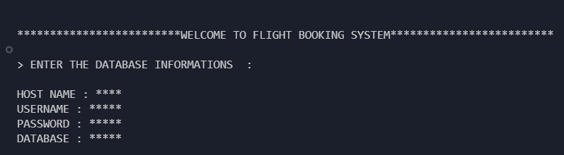
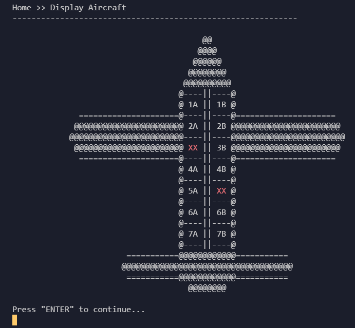
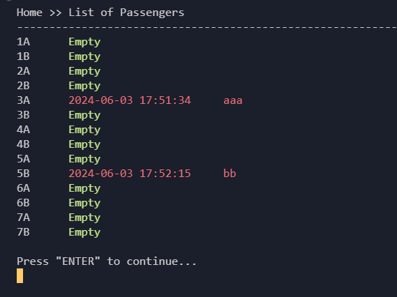

<h1 align="center">
    <a href=""> Airline Booking System</a>
</h1>

<p align="center">
  <i align="center">
     developed with Python and Mysql-Connector (Runs in terminal) 🚀</i>
</p>

<div align="center">

  

</div>

## Introduction

This Airline Booking System, developed in Python, runs in a terminal environment. As a freelance project,it includes various apps and classes that I am continuously enhancing with new features.
Many components of this system are versatile and can be applied to other real-world projects. Enjoy exploring it! :)


<details open>
<summary>
 Features
</summary> <br />


<table>
  <tr>
    <td></td>
    <td rowspan="3"></td>
  </tr>
  <tr>
    <td></td>
  </tr>
  <tr>
    <td></td>
  </tr>
</table>
    
</details>


## Usage 

To get started with Airline-Booking, first open your database and then Create a database named `airlines_booking`  before running the program.

> **Note**
> There is a flight example profile table with two types( text files and SQL) in TABLE folder. Select one of each file and then import it into the database. (just for working test) 

After registerin, the program Creates a table called `customers` by itself.

## Development

Befor you started to run a program completely you must install some libraries.

<details open>
<summary>
Pre-requisites
</summary> <br />
To be able to start development on Airline-Booking, make sure that you have the following prerequisties installed:

###

- python
- msql.connector
- csv

</details>

<details open>
<summary>
Running Airline-booking 
</summary> <br />


1. Clone the repository:
```shell
git clone https://github.com/Amirhoseindzh/Airline-Booking.git
```

The development environment should now be set up.
</details>


## Running Tests

Small summary of the kind of testing that exists in this repository 

### Unit Tests

Here is how you run unit tests :-P 

```
Yes, more commands, this is the real deal now
```

### Integration Tests

Here is how you run unit tests :-P 

```
Yes, more commands, this is the real deal now
```


## Resources

- **[YouTube](https://www.youtube.com/)** for guides.

<a name="contributing_anchor"></a>
## Contributing

Airline-booking is an open-source project. I committed to a fully transparent development process and highly appreciate any contributions. Whether you are helping me fix bugs, proposing new features, improving my documentation or spreading the word - we would love to have you as a part of the Airline-booking community. 

- Bug Report: If you see an error message or encounter an issue while using Amplication, please create a [bug report](https://github.com/Amirhoseindzh/Airline-Booking/issues/2#issue-2271571036).


## License

A large part of this project is licensed under the [Apache 2.0](./LICENSE) license. 
