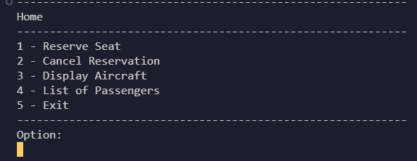

<h1 align="center">
    <a href=""> Airline Booking System</a>
</h1>

<p align="center">
  <i align="center">
     developed with Python and Mysql-Connector (Runs in terminal) 🚀</i>
</p>

<div align="center">

  

</div>

## Introduction

This Airline Booking System, developed in Python, runs in a terminal environment. As a freelance project,it includes various apps and classes that I am continuously enhancing with new features.
Many components of this system are versatile and can be applied to other real-world projects. Enjoy exploring it! :)


<details open>
<summary>
 Features
</summary> <br />


<table>
  <tr>
    <td></td>
    <td rowspan="3"></td>
  </tr>
  <tr>
    <td></td>
  </tr>
  <tr>
    <td></td>
  </tr>
</table>
    
</details>


## Pre-installation 

1. To get started with Airline-Booking, first, create a database named `airlines_booking`  before running the program.
  - Follow the steps below :
  ```
  # Open your command line and login to MySQL
> mysql -u root -p

# Enter your password when prompted
# Once logged in, create the database

> CREATE DATABASE Airlines_booking;

# Verify the database creation
> SHOW DATABASES;

# Select the newly created database
> USE Airlines_booking;

  ```
###
> **Note**  
> You can create a new database using the GUI version.
2. After clone, There is a flights table with types(txt, SQL) in folder `TABLE` . Select one and then import it into the database. (`it just for example and tests`) 
<div align="center">

  

</div>

3. After registerin user, the program auto creates a table called `customers` in first time.

## Installation
1. Follow the steps below to install app perfectly:
```shell
 > git clone https://github.com/Amirhoseindzh/Airline-Booking.git

 > pip install requirements.txt
```


## Running Tests

there is a test directory in `src/test` and created with `Unittest`.  

### Unit Tests

You can run the test with Coverage and Unittest command :-P 

```
python -m run Unittest src/test
#or
coverage run -m src/test 
```

## Resources

- **[YouTube](https://www.youtube.com/)** for guides.
- **[Google](https://www.google.com/)** for guides.
- **[Github](https://www.github.com/)** for guides.
- Chatgpt for guides.

<a name="contributing_anchor"></a>
## Contributing

Airline-booking is an open-source project. I committed to a fully transparent development process and highly appreciate any contributions. Whether you are helping me fix bugs, proposing new features, improving my documentation or spreading the word - we would love to have you as a part of the Airline-booking community. 

- Bug Report: If you see an error message or encounter an issue while using Amplication, please create a [bug report](https://github.com/Amirhoseindzh/Airline-Booking/issues/2#issue-2271571036).


## License

A large part of this project is licensed under the [Apache 2.0](./LICENSE) license. 
